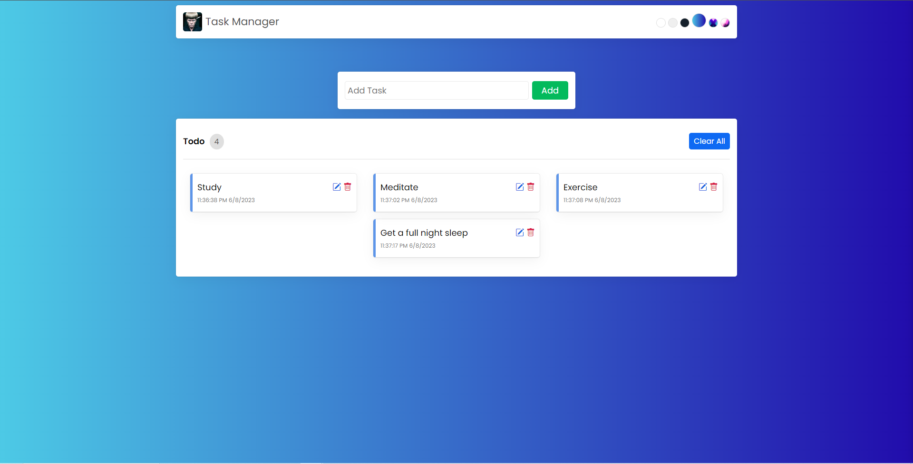

# Task Manager  

This task manager is a user-friendly web application built for those who need an organized and intuitive method for managing their tasks.

## Features

- **Task Management**  Users can easily create, update, and delete tasks as per their needs. Whether it's a daily task, a project, or a one-time event, manage them all efficiently in one place
- **Theme Customization** Provides the ability to change the application's theme based on user preference. Choose a theme that suits your style and comfort.
- **Local Storage** Tasks and theme is saved in your browser and ready for your next visit. 
- **Intuitive User Interfacee** The application provides an easy-to-navigate and understandable interface, allowing users to manage tasks with minimal effort.
- **Responsive Design** The application works flawlessly on any device, be it desktop, tablet, or mobile.

## Tech Stack
- JavaScript
- React
- HTML
- CSS
- JSX

## Contact

I'd love to hear from you about this project! If you have any questions, feedback, or potential collaboration opportunities, feel free to get in touch.

- [Email](mailto:johnclapper89@gmail.com)
- [LinkedIn](https://www.linkedin.com/in/john-clapper-476069192)
- [GitHub](https://github.com/britzky)
